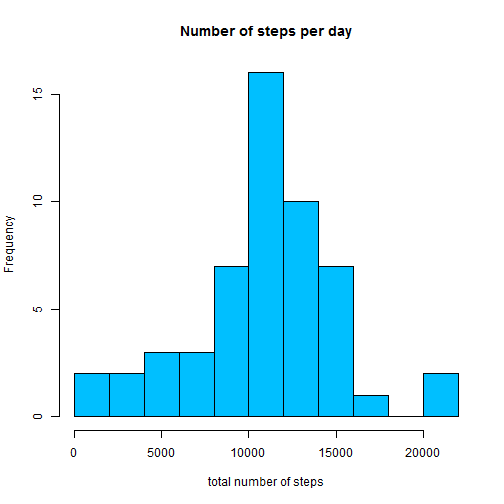

# Reproducible Research: Peer Assessment 1
Tested under Win 7 - 32 bit

To use the code set an appropriate working directory


## Loading and preprocessing the data

```r
if (!file.exists("activity.csv")) {
    url = "http://d396qusza40orc.cloudfront.net/repdata%2Fdata%2Factivity.zip"
    download.file(url, destfile = "activity.zip")
    unzip("activity.zip")
}
```

Open the dataset and recreate time variable from the interval


```r
activity_dataset = read.csv("activity.csv")
activity_dataset$interval = as.factor(sprintf("%02d:%02d", activity_dataset$interval%/%100, 
    activity_dataset$interval%%100))
activity_dataset$datetime = strptime(paste(activity_dataset$date, activity_dataset$interval), 
    "%F %H:%M")
str(activity_dataset)
```

```
## 'data.frame':	17568 obs. of  4 variables:
##  $ steps   : int  NA NA NA NA NA NA NA NA NA NA ...
##  $ date    : Factor w/ 61 levels "2012-10-01","2012-10-02",..: 1 1 1 1 1 1 1 1 1 1 ...
##  $ interval: Factor w/ 288 levels "00:00","00:05",..: 1 2 3 4 5 6 7 8 9 10 ...
##  $ datetime: POSIXlt, format: "2012-10-01 00:00:00" "2012-10-01 00:05:00" ...
```


## What is mean total number of steps taken per day?
### Histogram of the total number of steps taken each day
To find total number of steps taken each day we aggregate by day

Days where no observations were made (ie all values for step for that data are NA) are skipped entirely in this section


```r
daily_aggr_reduced = aggregate(steps ~ date, sum, data = activity_dataset, na.rm = T)
barplot(daily_aggr_reduced$steps, names.arg = daily_aggr_reduced$date, xlab = "date", 
    ylab = "total number of steps", main = "Total Number of Steps Taken Each Day")
```

 


Alternative Interpretaion:

```r
hist(daily_aggr_reduced$steps, xlab = "total number of steps", main = "Number of steps per day", 
    col = "deepskyblue", breaks = 10)
```

 


### Mean and median total number of steps taken per day
Mean total number of steps per day:

```r
mean(daily_aggr_reduced$steps)
```

```
## [1] 10766
```

Median:

```r
median(daily_aggr_reduced$steps)
```

```
## [1] 10765
```


NOTE: those values would be lower if different form of aggregation was used

For comparison purposes one can consider the following alternative aggregations

```r
# Aggregation 1

# aggregate(steps ~ date, sum, data = activity_dataset, na.rm = T, na.action
# = NULL)

# Aggregation 2

# tapply(activity_dataset$steps, activity_dataset$date, sum, na.rm = T)
```

In both cases above days which have only NAs would be counted as 0, instead of NA.

Finding mean and median for alternative interpretation is left out of this analysis


## What is the average daily activity pattern?
Here we use intervals to aggregate all non-NA data

```r
within_day_aggr_reduced = aggregate(steps ~ interval, mean, data = activity_dataset, 
    na.rm = T)
plot(within_day_aggr_reduced, pch = 20, main = "Average Number of steps taken within 5 minute interval")
lines(within_day_aggr_reduced)
```

 

```r
# minor downside of using factors, type = 'l' is ignored by the plot
# command, so separate lines call is required
```


Max number of steps is taken at the following time:

```r
within_day_aggr_reduced[which.max(within_day_aggr_reduced$steps), ]
```

```
##     interval steps
## 104    08:35 206.2
```

which is 8.35 AM, with around 200 steps (panic packing for work i presume)
## Imputing missing values
### Total number of missing values

```r
na_number = sum(is.na(activity_dataset$steps))
na_number
```

```
## [1] 2304
```

Total number of missing values is 2304


Using mean value for 5-min interval is used as a replacement for NA

```r
temp_dataset = merge(activity_dataset, within_day_aggr_reduced, by = "interval")
# sort dataset by the same variables
temp_dataset = temp_dataset[order(temp_dataset$datetime), ]
# impute values
activity_dataset$steps[is.na(activity_dataset$steps)] = temp_dataset$steps.y[is.na(activity_dataset$steps)]
rm(temp_dataset)
```


Now plot the total number of steps taken in each day


```r
daily_aggr = aggregate(steps ~ date, sum, data = activity_dataset)
barplot(daily_aggr$steps, names.arg = daily_aggr$date, xlab = "date", ylab = "total number of steps", 
    main = "Total Number of Steps Taken Each Day")
```

 


Alternative Interpretaion:

```r
hist(daily_aggr$steps, xlab = "total number of steps", main = "Number of steps per day", 
    col = "deepskyblue", breaks = 10)
```

 


Mean total number of steps per day:

```r
mean(daily_aggr$steps)
```

```
## [1] 10766
```

Median:

```r
median(daily_aggr$steps)
```

```
## [1] 10766
```


Major difference observed is that dataset became wider (higher in case of histogram), since we filled in the days which were entirely missed (for example first day), but the information provided serves no new information, as overall picture remains the same. Mean and median remained at around the same place, since mean was used to impute NAs, and median was at the same place as mean for this dataset

## Are there differences in activity patterns between weekdays and weekends?

```r
activity_dataset$weekdays = weekdays(activity_dataset$datetime)

within_day_aggr_weekdays = aggregate(steps ~ interval, mean, data = activity_dataset[!(activity_dataset$weekdays %in% 
    c("Saturday", "Sunday")), ])
within_day_aggr_weekends = aggregate(steps ~ interval, mean, data = activity_dataset[(activity_dataset$weekdays %in% 
    c("Saturday", "Sunday")), ])

par(mfrow = c(2, 1))
plot(within_day_aggr_weekdays, pch = 20, main = "Weekdays")
lines(within_day_aggr_weekdays)
plot(within_day_aggr_weekends, pch = 20, main = "Weekends")
lines(within_day_aggr_weekends)
```

 


As we can see on workdays major activity apears on pre-work, lunch and post-work hours, with the biggest peak in the morning

In case of weekends activities tend to be distributed more uniformly across the day
